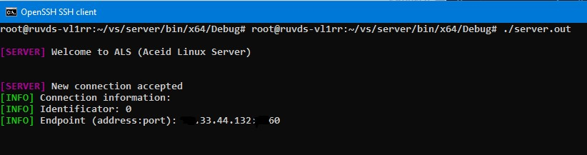

# Basic implementation of TCP/IP connection (Linux + Windows)

This example was developed as an illustrative implementation of client-server architecture. The client is designed for the Windows x64 operating system, while the server is developed for the Linux operating system.
This project implements communication methods which will be discussed below.

# Installing
To clone the repository, you can simply use the universal git cloning method:
```
git clone https://github.com/soamane/linux-basic-sockets.git
```

## Includes
**This repository does not include any additional external libraries; everything is based on the built-in Windows/POSIX libraries.**

# Usage
+ **Change the address and port of the endpoint (remote server) in each main.cpp file of the projects.**
  ### Client (main.cpp)
  ```C++
  Client client;
	client.JoinToServer("193.124.114.141", 1337);
  ```
  ### Server (main.cpp)
  ```C++
  Server server;
	server.Start("193.124.114.141", 1337);
  ```
+ **Build the project using any of the available methods**
  - For instance, the server was built using the built-in Linux application development system in Visual Studio 2022.
